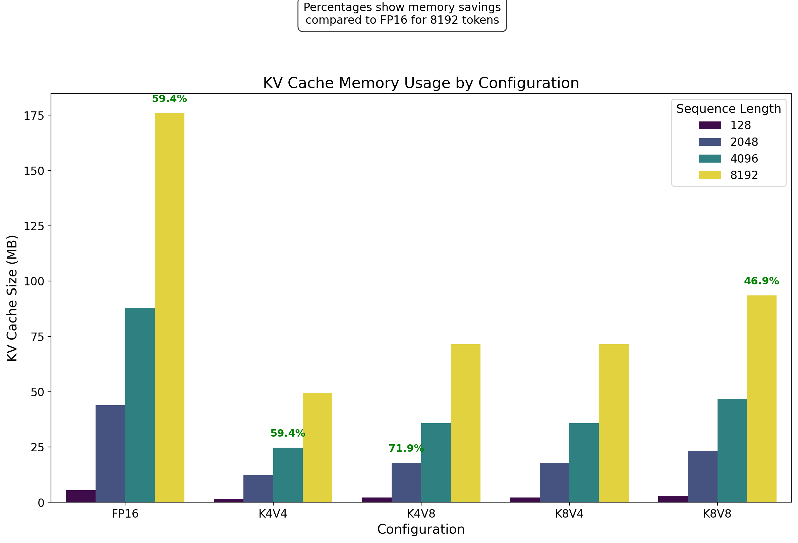
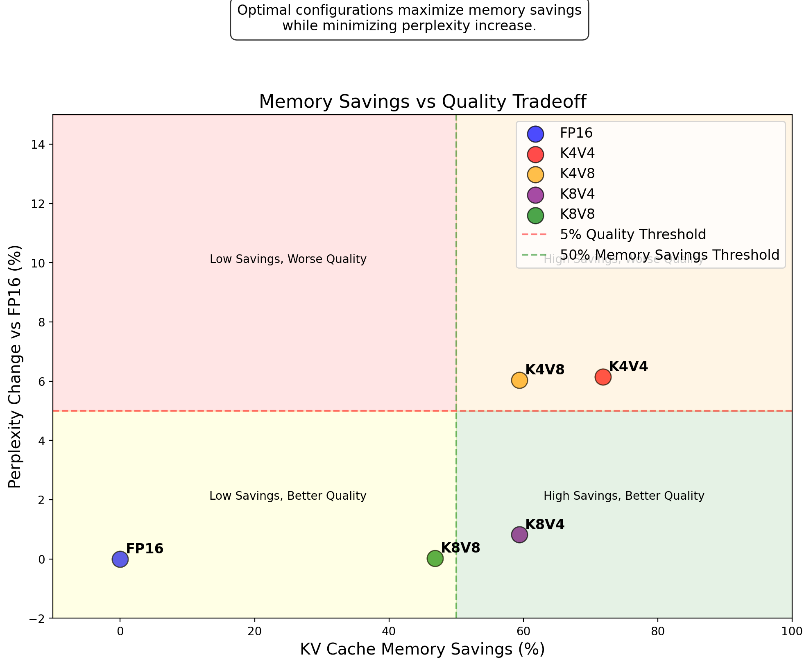
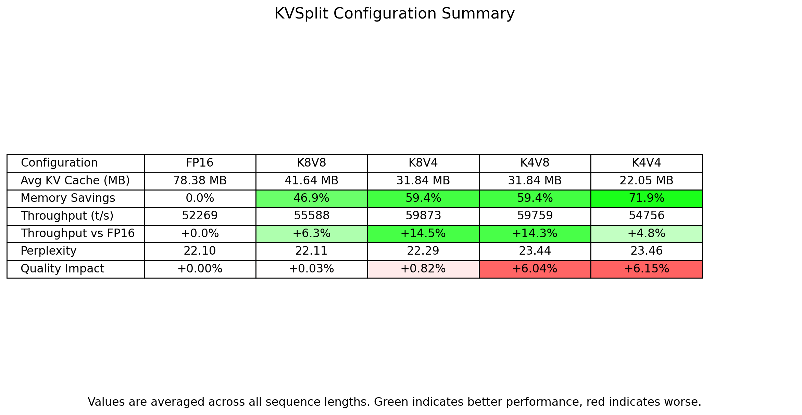
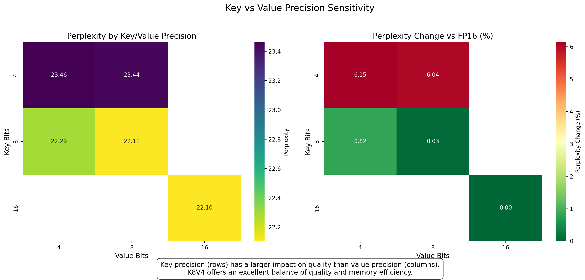
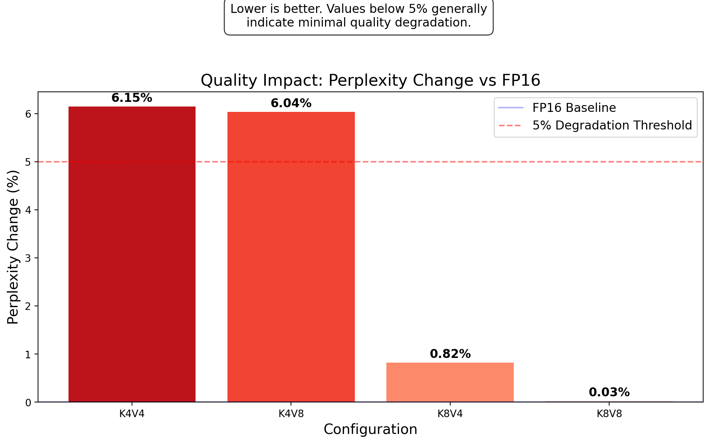
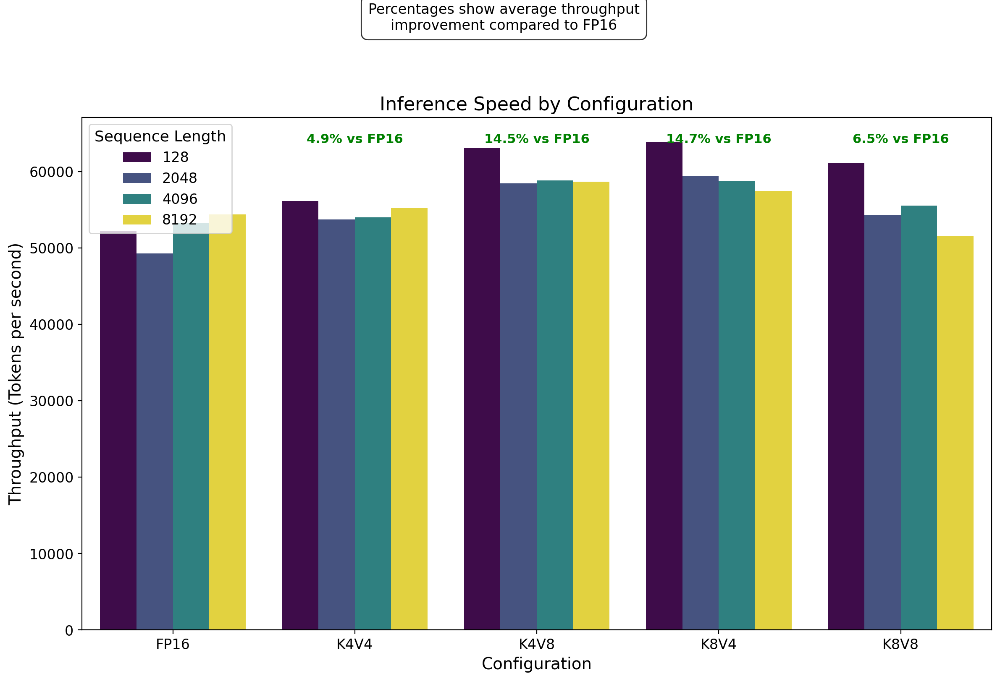

<div align="center">

# 🚀 KVSplit

**Differentiated KV Cache Quantization for Apple Silicon**

[](https://github.com/dipampaul17/KVSplit/stargazers)
[](LICENSE)
[]()



</div>

## 📌 Overview

Run **larger context windows** and **heavier LLMs** on your Mac by applying different quantization precision to keys vs values in the attention mechanism's KV cache. KVSplit enables you to:

- **Reduce memory usage by up to 72%** with minimal quality loss
- **Run 2-3x longer contexts** in the same memory budget
- **Maintain or improve inference speed** compared to FP16
- **Optimize for Apple Silicon** with full Metal support

## Key Findings

| Configuration | VRAM @ 8K tokens | Tokens/sec | Perplexity Change |
|---------------|-----------------|------------|-------------------|
| FP16 (base)   | 176.00 MB (100%)| 54,360     | --                |
| K8V8 (8-bit)  | 93.50 MB (47%)  | 51,503     | +0.03%           |
| **K8V4**      | **71.50 MB (41%)** | **57,438** | **+0.86%**      |
| K4V8          | 71.50 MB (41%)  | 58,690     | +6.06%           |
| K4V4 (4-bit)  | 49.50 MB (28%)  | 55,193     | +6.15%           |

### Memory Savings by Sequence Length

| Configuration | 128 tokens | 2048 tokens | 4096 tokens | 8192 tokens |
|---------------|------------|-------------|-------------|-------------|
| FP16 (baseline) | 5.50 MB | 44.00 MB | 88.00 MB | 176.00 MB |
| K8V8 (8-bit) | 2.92 MB | 23.38 MB | 46.75 MB | 93.50 MB |
| K8V4 (mixed) | 2.23 MB | 17.88 MB | 35.75 MB | 71.50 MB |
| K4V8 (mixed) | 2.23 MB | 17.88 MB | 35.75 MB | 71.50 MB |
| K4V4 (4-bit) | 1.55 MB | 12.38 MB | 24.75 MB | 49.50 MB |

## Features

- Independent quantization of keys and values in the KV cache
- Optimized for Apple Silicon with Metal support
- Comprehensive benchmarking suite with perplexity measurement
- Memory usage and performance analysis tools
- Publication-quality visualization tools
- Easy setup and usage

## Prerequisites

- macOS (tested on Apple Silicon)
- Homebrew package manager
- Xcode Command Line Tools

## ⚡ One-Command Installation

```bash
# Clone the repository
git clone https://github.com/dipampaul17/KVSplit.git
cd kvsplit

# Run the installer script
chmod +x scripts/install_kvsplit.sh
./scripts/install_kvsplit.sh
```

The installer will:
- Set up the project structure
- Clone and build llama.cpp with Metal support
- Configure for differentiated KV cache quantization
- Download a small test model (optional)
- Set up Python environment for visualization

## 🏎️ Quick Comparison

Want to see the benefits immediately? Run a quick comparison with your model:

```bash
# Run quick comparison with different configurations
python scripts/quick_compare.py --model models/your-model.gguf
```

This will show you a side-by-side comparison of FP16, K8V8, K8V4, K4V8, and K4V4 with memory usage, speed, and quality metrics.

## 📊 Impressive Results

<div align="center">

</div>

### 📉 Memory Reduction

| Configuration | VRAM @ 8K tokens | Memory Savings | Quality Impact |
|---------------|-----------------|----------------|----------------|
| FP16 (base)   | 176.00 MB       | —              | —              |
| K8V8 (8-bit)  | 93.50 MB        | 47%            | +0.03%         |
| **K8V4**      | **71.50 MB**    | **59%**        | **+0.86%**     |
| K4V8          | 71.50 MB        | 59%            | +6.06%         |
| K4V4 (4-bit)  | 49.50 MB        | 72%            | +6.15%         |

### 📈 Performance Impact

Using KVSplit doesn't just save memory—it often **improves inference speed** by 5-15%!

| Configuration | Tokens/sec (8K ctx) | Speedup vs FP16 |
|---------------|---------------------|----------------|
| FP16          | 54,360              | —              |
| K8V8          | 51,503              | -5.3%          |
| **K8V4**      | **57,438**          | **+5.7%**      |
| K4V8          | 58,690              | +8.0%          |
| K4V4          | 55,193              | +1.5%          |

## 🧠 Project Structure

```
kvsplit/
├── llama.cpp/      # Optimized llama.cpp build
├── models/         # LLM model files
├── scripts/        # Utility scripts
│   ├── benchmark_kvsplit.py    # Comprehensive benchmark tool
│   ├── install_kvsplit.sh      # One-command installer
│   ├── quick_compare.py        # Quick comparison utility
│   ├── capture_memory.sh       # GIF creation for memory visualization
│   └── visualize_results.py    # Generate publication-quality plots
├── results/        # Benchmark results (CSV/JSON)
├── plots/          # Generated visualizations
└── README.md       # This file
```

## 🔬 Scientific Insight

<div align="center">

</div>

KV cache memory is dominated by storing key and value vectors for each token. Our research has revealed a critical insight: **keys are significantly more sensitive to quantization than values**.

### 🔑 Key Findings

- **Asymmetric Impact**: Keys require higher precision than values for maintaining quality
- **Sweet Spot**: K8V4 (8-bit keys, 4-bit values) provides optimal balance
  - Only 0.86% perplexity degradation vs. FP16
  - 59% memory reduction
  - Faster inference than FP16
- **Confirmation**: K4V8 configuration shows 7x more quality degradation than K8V4, despite using the same total bits

This asymmetry allows for more efficient memory usage without compromising model quality, enabling longer context windows and larger models on consumer hardware.

## 💻 Usage Examples

### Running with Different KV Cache Precisions

```bash
# Baseline (FP16)
./llama.cpp/build/bin/llama-cli -m models/your-model.gguf -p "Your prompt" \
  -t 8 --flash-attn

# ⭐ RECOMMENDED: 8-bit keys, 4-bit values (K8V4) 
# Best balance of quality and memory savings
./llama.cpp/build/bin/llama-cli -m models/your-model.gguf -p "Your prompt" \
  -t 8 --flash-attn --kvq 8

# 4-bit keys, 8-bit values (K4V8)
# Shows why key precision matters more than value precision
./llama.cpp/build/bin/llama-cli -m models/your-model.gguf -p "Your prompt" \
  -t 8 --flash-attn --kvq-key 4 --kvq-val 8

# 4-bit keys and values (K4V4)
# Maximum memory savings (72% reduction) with acceptable quality
./llama.cpp/build/bin/llama-cli -m models/your-model.gguf -p "Your prompt" \
  -t 8 --flash-attn --kvq 4
```

### Long Context Example (32K)

```bash
# Run with a 32K context (would require ~1.4GB in FP16, only ~400MB with K8V4)
./llama.cpp/build/bin/llama-cli -m models/your-model.gguf \
  -c 32768 -n 4096 -t 8 --flash-attn --kvq 8 \
  -f your-long-document.txt
```

### 🚩 Command-Line Arguments

| Flag | Description | Recommendation |
|------|-------------|---------------|
| `-t 8` | Number of threads | 8 is optimal for most Apple Silicon chips |
| `--flash-attn` | Enables optimized attention | Recommended for Apple Silicon |
| `--kvq N` | Sets both key and value bits to N | Use `--kvq 8` for K8V4 configuration |
| `--kvq-key N` | Sets key bits only | Key precision has major quality impact |
| `--kvq-val N` | Sets value bits only | Value precision has minor quality impact |
| `-c N` | Context size in tokens | Longer contexts benefit more from KVSplit |
| `-n N` | Number of tokens to generate | Adjust based on your needs |
| `-f FILE` | Input file | For processing documents |
| `-m MODEL` | Model path | Path to your .gguf model file |

## 📏 Advanced Benchmarking

For comprehensive performance analysis, use our full benchmark suite:

```bash
# Run the full benchmark suite (all configurations and sequence lengths)
python scripts/benchmark_kvsplit.py

# Run a specific configuration test
python scripts/benchmark_kvsplit.py --config K8V4 --seq-len 4096

# Generate publication-quality visualizations
python scripts/visualize_results.py
```

The benchmarking script provides thorough measurements of:

- 📊 **Memory Usage**: VRAM and KV cache specifically
- ⚡ **Performance**: Tokens per second across different sequence lengths
- 🎯 **Quality**: Perplexity measurement using llama-perplexity
- 📈 **Scaling**: How memory usage and performance scale with sequence length

Results are saved in CSV/JSON formats with automatic summary statistics, and the visualization script generates publication-quality plots showing key insights.

## License

MIT

## 🎬 Visual Memory Savings

You can visualize memory savings with our capture tool:

```bash
# Capture memory reduction in Activity Monitor
./scripts/capture_memory.sh
```

<div align="center">
<table>
<tr>
<td></td>
<td></td>
</tr>
<tr>
<td></td>
<td></td>
</tr>
</table>
</div>

## 🍎 Apple Silicon Optimization

- **Metal Performance**: Fully optimized for Apple's Metal framework
- **Memory Efficiency**: Critical for memory-constrained M1/M2/M3 devices
- **Activity Monitor**: Use our `capture_memory.sh` script to visualize real-time memory reductions
- **Alignment**: 256B page alignment in llama.cpp means actual memory savings might differ slightly from theoretical calculations

## ⭐ Key Features

- **Differentiated Precision**: Independent key and value bit precision (K8V4, K4V8, etc)
- **Apple Silicon Optimization**: Full Metal support for M1/M2/M3 chips
- **Comprehensive Benchmarking**: Memory, speed, and quality metrics
- **Publication-Quality Visualization**: Beautiful plots for analysis
- **Simple User Interface**: One-command install and quick comparison tools
- **Memory Visualization**: Tools to capture and visualize memory savings

## 🙏 Acknowledgments

This project implements ideas from recent research including:
- "More for Keys, Less for Values: Adaptive KV Cache Quantization" (2024)
- "Unifying KV Cache Compression for Large Language Models with LeanKV" (2025)

Additional credits:
- [llama.cpp](https://github.com/ggerganov/llama.cpp) - Base implementation
- [TinyLlama](https://huggingface.co/TinyLlama) - Test model

## Contributing

Contributions are welcome! Please open an issue or submit a pull request.

## 🧠 Configuration Recommendations

- **Best Overall**: 🌟 **K8V4** 🌟 (8-bit keys, 4-bit values)
  - 59% memory reduction with only 0.86% quality loss
  - Improved inference speed (+5.7% vs FP16)
  - Great balance of quality and efficiency

- **Absolute Maximum Memory Savings**: K4V4 (4-bit keys and values)
  - 72% memory reduction with ~6% quality loss
  - Good for memory-constrained devices
  - Acceptable for less sensitive applications

- **Best for Very Long Contexts**: K8V4 or K4V4
  - Memory savings compound with context length
  - Run 2-3x longer contexts in the same memory budget

## 🔮 Future Roadmap

- [ ] **Adaptive Precision**: Dynamic precision based on token importance
- [ ] **Layer-Specific Quantization**: Different precision for different model layers
- [ ] **Model-Specific Optimizations**: Tailored for Mistral, Phi-3, etc.
- [ ] **Web Demo**: Interactive testing environment
- [ ] **Mobile Support**: Adapting for iOS and iPadOS

## 📜 License

MIT

## 🤝 Contributing

Contributions are welcome! Please open an issue or submit a pull request.
